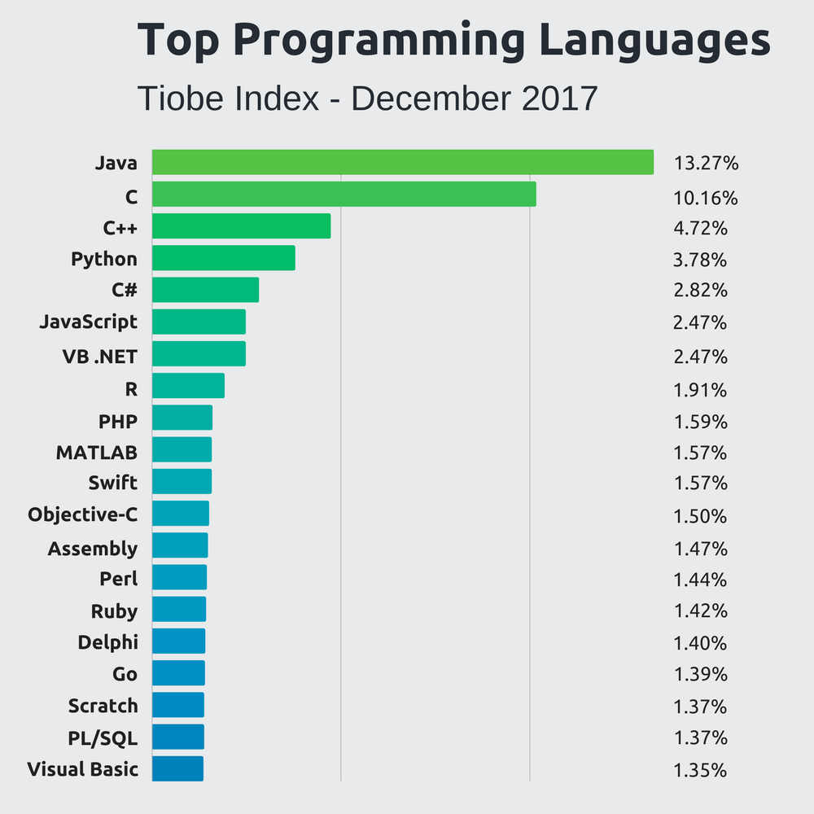

# Ben Brown

I am a senior at NWMSU pursuing my Bachelor's degree in Applied Computer Science.  Here are some interesting computer science-y facts.

## Top Coding Languages

1. Java
2. JavaScript
3. C++
4. C#
5. Swift
6. Python

## Sorting Algorithms

- Selection 
- Insertion 
- Bubble 
- Exchange

[This is my LinkedIn](https://www.linkedin.com/in/benjamin-brown-0961b1170)
[This is my GitHub](https://github.com/BenB049)
[A helpful website](https://www.google.com)

